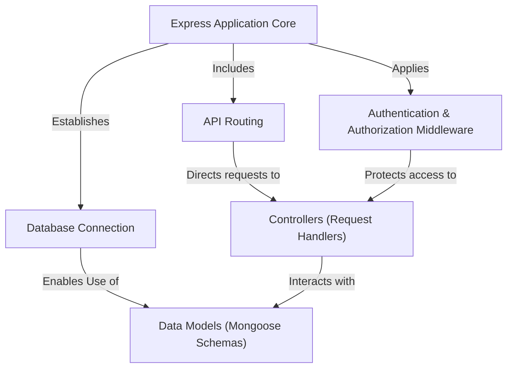

# Tutorial: E-Learn-Backend

This project is the **backend server** for an *e-learning platform*.
It manages **user accounts**, **courses**, and **mentors**, handles
**authentication** for security, and provides **API endpoints** for
the frontend to interact with the **database** where all content and
user data is stored.

## Visual Overview

## Chapters

1. [Express Application Core
](01_express_application_core_.md)
2. [Database Connection
](02_database_connection_.md)
3. [Data Models (Mongoose Schemas)
](03_data_models__mongoose_schemas__.md)
4. [Authentication & Authorization Middleware
](04_authentication___authorization_middleware_.md)
5. [API Routing
](05_api_routing_.md)
6. [Controllers (Request Handlers)
](06_controllers__request_handlers__.md)

---

Generated by [AI Codebase Knowledge Builder](https://github.com/The-Pocket/Tutorial-Codebase-Knowledge).
